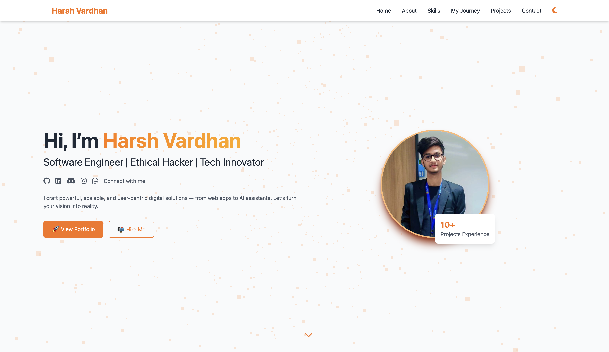
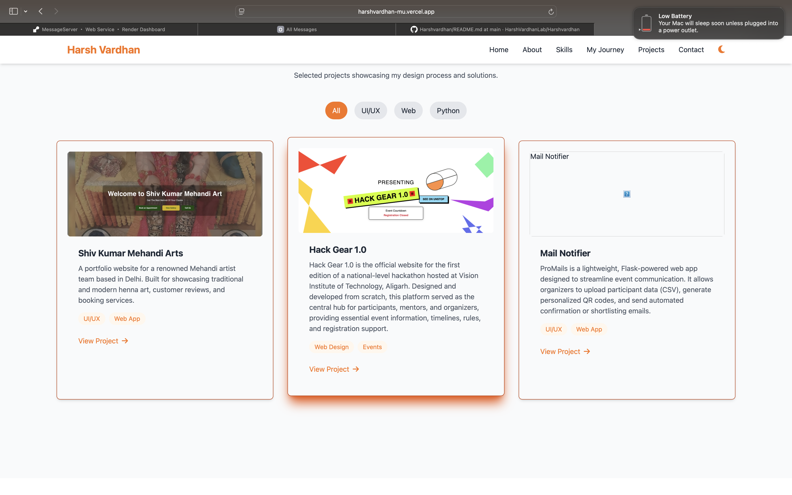

# 💼 Harsh Vardhan - Enhanced Portfolio

A modern, feature-rich portfolio website built with **Flask (Python)**, showcasing advanced web development skills with comprehensive backend functionality.

## 🚀 Features

### ✅ Frontend Enhancements
- **Responsive Design** - Mobile-first approach with Tailwind CSS
- **Dark/Light Mode** - Dynamic theme switching with smooth transitions
- **Advanced Animations** - GSAP-powered scroll animations and micro-interactions
- **3D Effects** - Enhanced project cards with 3D hover effects
- **Typing Animation** - Dynamic text animation for hero section
- **Lazy Loading** - Optimized image loading for better performance
- **PWA Support** - Progressive Web App capabilities
- **Accessibility** - ARIA labels, keyboard navigation, screen reader support

### ✅ Backend Features
- **Flask API** - RESTful API endpoints for contact form and analytics
- **Rate Limiting** - Protection against spam and abuse
- **Caching** - Performance optimization with intelligent caching
- **Security Headers** - Comprehensive security with CSP, HSTS, etc.
- **Error Handling** - Custom 404 and 500 error pages
- **Logging** - Structured logging for monitoring and debugging
- **Configuration Management** - Environment-based configuration
- **Health Checks** - Monitoring endpoints for deployment

### ✅ SEO & Performance
- **Meta Tags** - Comprehensive SEO optimization
- **Structured Data** - JSON-LD for rich snippets
- **Sitemap** - Automatic XML sitemap generation
- **Robots.txt** - Search engine optimization
- **Performance** - Optimized loading with CDN and caching
- **Analytics** - Visit tracking and basic analytics

## 📂 Project Structure

```
My Portfolio/
├── app.py                 # Main Flask application
├── config.py             # Configuration management
├── deploy.py             # Deployment script
├── requirements.txt      # Python dependencies
├── templates/
│   ├── index.html       # Main portfolio page
│   ├── 404.html         # Custom 404 error page
│   └── 500.html         # Custom 500 error page
├── static/
│   ├── assets/          # Images and media files
│   ├── manifest.json    # PWA manifest
│   └── sw.js           # Service worker
├── render.yaml          # Render deployment config
└── vercel.json         # Vercel deployment config
```

## 🔧 Tech Stack

- **Frontend:** HTML5, CSS3, JavaScript, Tailwind CSS, GSAP
- **Backend:** Python (Flask), Flask-Caching, Flask-Limiter
- **Performance:** Lazy loading, CDN, caching, compression
- **Security:** Rate limiting, security headers, input validation
- **Deployment:** Vercel, Render, PythonAnywhere ready

## 🚀 Quick Start

### Local Development

1. **Clone the repository**
   ```bash
   git clone https://github.com/HarshVardhanLab/Harshvardhan.git
   cd Harshvardhan
   ```

2. **Install dependencies**
   ```bash
   pip install -r requirements.txt
   ```

3. **Run the development server**
   ```bash
   python deploy.py
   # or
   python app.py
   ```

4. **Access the application**
   - Main site: http://localhost:5000
   - API docs: http://localhost:5000/api/docs
   - Health check: http://localhost:5000/health

### Production Deployment

#### Vercel Deployment
```bash
# Install Vercel CLI
npm i -g vercel

# Deploy
vercel --prod
```

#### Render Deployment
- Connect your GitHub repository
- Set build command: `pip install -r requirements.txt`
- Set start command: `gunicorn app:app`

## 📡 API Endpoints

### Contact Form
```http
POST /api/contact
Content-Type: application/json

{
  "name": "John Doe",
  "email": "john@example.com",
  "message": "Hello, I'd like to discuss a project."
}
```

### Analytics
```http
GET /api/analytics
```

### Health Check
```http
GET /health
```

### API Documentation
```http
GET /api/docs
```

## 🔒 Security Features

- **Rate Limiting** - 5 contact submissions per minute
- **Input Validation** - Comprehensive form validation
- **Security Headers** - XSS protection, CSRF protection
- **Content Security Policy** - Resource loading restrictions
- **HTTPS Enforcement** - HSTS headers for production

## 📊 Performance Features

- **Caching** - 5-minute cache for main page
- **Lazy Loading** - Images load as needed
- **CDN Integration** - Optimized external resources
- **Compression** - Gzip compression for faster loading
- **Minification** - Optimized CSS and JavaScript

## 🎨 UI/UX Features

- **Dark/Light Mode** - Automatic theme detection
- **Smooth Animations** - GSAP-powered transitions
- **3D Effects** - Enhanced project card interactions
- **Responsive Design** - Mobile-first approach
- **Accessibility** - WCAG 2.1 compliant
- **Loading States** - Visual feedback for user actions

## 🔧 Configuration

The application uses environment-based configuration:

```python
# Development
FLASK_ENV=development

# Production
FLASK_ENV=production
SECRET_KEY=your-secure-secret-key
```

## 📈 Monitoring

- **Health Checks** - `/health` endpoint for monitoring
- **Logging** - Structured logging for debugging
- **Analytics** - Basic visit tracking
- **Error Handling** - Custom error pages

## 🚀 Deployment

### Environment Variables
```bash
FLASK_ENV=production
SECRET_KEY=your-secure-secret-key
PORT=5000
```

### Supported Platforms
- ✅ Vercel
- ✅ Render
- ✅ PythonAnywhere
- ✅ Heroku
- ✅ Railway

## 📸 Screenshots

| Home Page | Projects Section | Contact Form |
|-----------|------------------|--------------|
|  |  | Contact form with validation |

## 🤝 Contributing

1. Fork the repository
2. Create a feature branch
3. Make your changes
4. Test thoroughly
5. Submit a pull request

## 📄 License

This project is licensed under the MIT License - see the LICENSE file for details.

## 📞 Contact

- **Email:** harshvardhan02102002@gmail.com
- **WhatsApp:** +91 9528693084
- **LinkedIn:** [Harsh Vardhan](https://linkedin.com/in/harsh-vardhan-285122235)
- **GitHub:** [HarshVardhanLab](https://github.com/HarshVardhanLab)

---

**Built with ❤️ by Harsh Vardhan**
